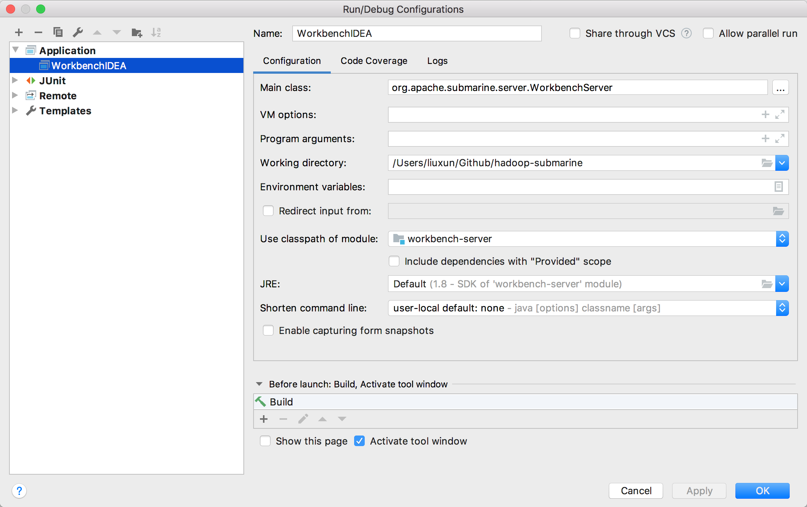

<!--
   Licensed to the Apache Software Foundation (ASF) under one or more
   contributor license agreements.  See the NOTICE file distributed with
   this work for additional information regarding copyright ownership.
   The ASF licenses this file to You under the Apache License, Version 2.0
   (the "License"); you may not use this file except in compliance with
   the License.  You may obtain a copy of the License at
   http://www.apache.org/licenses/LICENSE-2.0
   Unless required by applicable law or agreed to in writing, software
   distributed under the License is distributed on an "AS IS" BASIS,
   WITHOUT WARRANTIES OR CONDITIONS OF ANY KIND, either express or implied.
   See the License for the specific language governing permissions and
   limitations under the License.
-->
# Development Guide

## 1. Introduction

This document mainly describes the structure of each module of the Submarine project, the development and test description of each module.

## 2. Submarine Project Structure

### 2.1. dev-support

+ **mini-submarine**: by using the docker image provided by Submarine, you can
experience all the functions of Submarine in a single docker environment, while
mini-submarine also provides developers with a development and testing
environment, Avoid the hassle of installing and deploying the runtime
environment.
+ **submarine-installer**: submarine-installer is our submarine runtime
environment installation tool for yarn-3.1+ and above.By using
submarine-installer, it is easy to install and deploy system services such as
`docker`, `nvidia-docker`, `nvidia driver`, `ETCD`, `Calico network` etc.
required by yarn-3.1+.

### 2.2. submarine-all

Waiting for supplement

### 2.3. submarine-core

Waiting for supplement

### 2.4. submarine-dist

Waiting for supplement

### 2.5. submarine-runtime

Waiting for supplement

### 2.6. submarine-sdk
+ **pysubmarine**: By using Submarine's python sdk library, you can output
metrics such as metrics when the algorithm is executed in your python program by
importing pysubmarine during the development of the machine learning algorithm.

### 2.7. submarine-workbench
+ **workbench-server**: is a Jetty-based web server service. Workbench-server
provides RESTful interface and Websocket interface. The RESTful interface
provides workbench-web with management capabilities for databases such as
project, department, user, and role.
+ **workbench-web**: is a web front-end service based on `VUE.js` framework.
With `workbench-web` users can manage Submarine project, department, user, role
through browser. You can also use the notebook to develop machine learning
algorithms, model release and other lifecycle management.

## 3. Submarine Workbench Development Guide

Submarine workbench consists of three modules: workbench-server, workbench-web
and database.

First, you need to clone the entire Submarine project:

```
git clone https://github.com/apache/submarine.git
```

## 3.1 Database

Submarine selects mysql as the workbench database, and stores the table
structure and information of all the data in workbench in mysql. Please browse
the project's [Submarine Database Guide](../database/) documentation and follow
the instructions to install a mysql database via docker in your development and
test environment.

## 3.2 Workbench-web

+ **Install dependencies**

You only need to execute the following command when you run workbench-web for
the first time, so you can follow the depend. environment of node.js in the
workbench-web directory.

```bash
cd submarine-workbench/workbench-web
yarn install
```

The node.js dependency library will be installed in the node_modules directory. node_modules does not need to be uploaded to the git repository. We have excluded it in the submarine/.gitignore file. You can clean this by manually deleting the directory or executing mvn clean. table of Contents.

+ **Compiles and hot-reloads for development**

```bash
yarn run build
```

By executing the above command, `workbench-web` will publish the web page to the `workbench-web/dist` directory. Later we will also add the feature of `workbench-web` to a WAR package, which only requires a `workbench-web.war` file. Package can release submarine workbench.

+ **Lints and fixes files**

When you write the `Angular, js` file in `workbench-web` through IDEA, because IDEA can't format these files well, you need to execute the following command to format the angular and js files to avoid some warnings during the yarn build.

```
yarn run lint
```

In fact, you must execute this command when you develop and submit any workbench-web feature. Otherwise, chances are that you won't be able to check the code specification we set up in Travis.

## 3.3 Workbench-server

Workbench-server has a built-in jetty server service, so you don't need to install any web container service. You can start submarine workbench by launching `workbench-server` directly in IDEA.

+ **Run / Debug** : In the IDEA, add a Run/Debug Configuration, `Main Class:` select `org.apache.submarine.server.SubmarineServer`, `Use classpath of module:` select `submarine-server-core`.



So you can pass http://127.0.0.1:8080 debugging or running to submarine-workbench.

+ **It should be noted**:

1. Because `workbench-web/dist` is the webapp default directory of the workbench-server Jetty Server, the workbench-server will automatically load the `workbench-web/dist` directory after startup.

2. The `workbench-web/dist` used by `workbench-server` is used as the webapp directory, which is configured via `workbench-site.xml`, but we do not recommend you to modify it.

3. The submarine-workbench, IP and 8080 ports that are accessible locally through the port 8080 of 127.0.0.1 are configured via  `workbench-site.xml`, but we do not recommend you to modify it.

4. When you modify the `angular` or `js` of workbench-web, you need to execute the yarn run build command in the workbench-web directory, and let your modified code update to the dist directory, so that you can see the effect of your code modification in the workbench.
