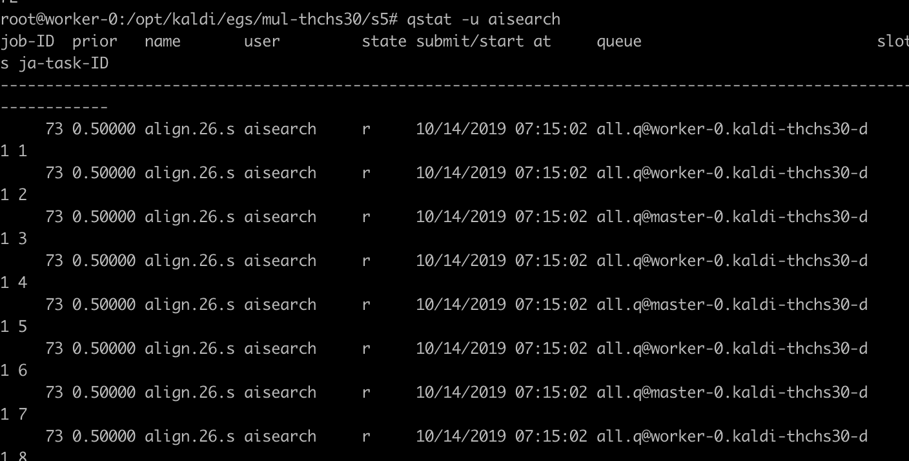

<!--
   Licensed to the Apache Software Foundation (ASF) under one or more
   contributor license agreements.  See the NOTICE file distributed with
   this work for additional information regarding copyright ownership.
   The ASF licenses this file to You under the Apache License, Version 2.0
   (the "License"); you may not use this file except in compliance with
   the License.  You may obtain a copy of the License at
   http://www.apache.org/licenses/LICENSE-2.0
   Unless required by applicable law or agreed to in writing, software
   distributed under the License is distributed on an "AS IS" BASIS,
   WITHOUT WARRANTIES OR CONDITIONS OF ANY KIND, either express or implied.
   See the License for the specific language governing permissions and
   limitations under the License.
-->

# Thchs30 Kaldi Example With YARN Service

## Prepare data for training

Thchs30 is a common benchmark in machine learning for speech data and transcripts. Below example is based on Thchs30 dataset.

1) download gz file:
```
THCHS30_PATH=/data/hdfs1/nfs/aisearch/kaldi/thchs30
mkdir $THCHS30_PATH/data && cd $THCHS30_PATH/data
wget http://www.openslr.org/resources/18/data_thchs30.tgz
wget http://www.openslr.org/resources/18/test-noise.tgz
wget http://www.openslr.org/resources/18/resource.tgz
```

2) Checkout https://github.com/apache/submarine.git:
```
git clone https://github.com/apache/submarine.git
```

3) Go to `submarine/docker/ecosystem/`
```
cp -r ./kaldi/sge $THCHS30_PATH/sge
```

4) optional，Modify `/opt/kaldi/egs/thchs30/s5/cmd.sh` in the Container,This queue is used by default
```
export train_cmd="queue.pl -q all.q"
```

**Warning:**

Please note that YARN service doesn't allow multiple services with the same name, so please run following command
```
yarn application -destroy <service-name>
```
to delete services if you want to reuse the same service name.

## Prepare Docker images

Refer to [Write Dockerfile](WriteDockerfileKaldi.md) to build a Docker image or use prebuilt one:

- hadoopsubmarine/kaldi-latest-gpu-base:0.0.1

## Run Kaldi jobs

### Run distributed training

```
# Change the variables according to your needs
SUBMARINE_VERSION=3.3.0-SNAPSHOT
WORKER_NUM=2
SGE_CFG_PATH=/cfg
THCHS30_PATH=/data/hdfs1/nfs/aisearch/kaldi/thchs30
DOCKER_HADOOP_HDFS_HOME=/app/${SUBMARINE_VERSION}

# Dependent on registrydns, you must fill in < your RegistryDNSIP> in resolv.conf
yarn jar /usr/local/matrix/share/hadoop/yarn/${SUBMARINE_VERSION}.jar \
job run --name kaldi-thchs30-distributed \
--env DOCKER_JAVA_HOME=/usr/lib/jvm/java-8-openjdk-amd64/jre/ \
--env DOCKER_HADOOP_HDFS_HOME=$DOCKER_HADOOP_HDFS_HOME \
--env YARN_CONTAINER_RUNTIME_DOCKER_CONTAINER_NETWORK=calico-network \
--env PYTHONUNBUFFERED="0" \
--env TZ="Asia/Shanghai" \
--env YARN_CONTAINER_RUNTIME_DOCKER_MOUNTS=${THCHS30_PATH}/sge/resolv.conf:/etc/resolv.conf,\
${THCHS30_PATH}/sge/passwd:/etc/passwd:rw,\
${THCHS30_PATH}/sge/group:/etc/group:rw,\
${THCHS30_PATH}/sge:$SGE_CFG_PATH,\
${THCHS30_PATH}/data:/opt/kaldi/egs/thchs30,\
${THCHS30_PATH}/mul/s5:/opt/kaldi/egs/mul-thchs30/s5 \
--input_path /opt/kaldi/egs/thchs30/data \
--docker_image hadoopsubmarine/kaldi-latest-gpu-base:0.0.1 \
--num_workers $WORKER_NUM \
--worker_resources memory=64G,vcores=32,gpu=1 \
--worker_launch_cmd "sudo mkdir -p /opt/kaldi/egs/mul-thchs30/s5 && \
sudo cp /opt/kaldi/egs/thchs30/s5/* /opt/kaldi/egs/mul-thchs30/s5 -r && \
cluster_user=`whoami` domain_suffix="ml.com" && \
cd /cfg && bash sge_run.sh $WORKER_NUM $SGE_CFG_PATH && \
if [ $(echo $HOST_NAME |grep "^master-") ] then sleep 2m && cd /opt/kaldi/egs/mul-thchs30/s5 && ./run.sh fi" \
--verbose
```

Explanations:

- `>1` num_workers indicates it is a distributed training.
- Parameters / resources / Docker image of parameter server can be specified separately. For many cases, parameter server doesn't require GPU.We don't need parameter server here

For the meaning of the individual parameters, see the [QuickStart](project/github/submarine/docs/userdocs/yarn/QuickStart.md) page!

*Outputs of distributed training*

Sample output of master:
```
...
Reading package lists...
Building dependency tree...
Reading state information...
The following additional packages will be installed:
  bsd-mailx cpio gridengine-common ifupdown iproute2 isc-dhcp-client
  isc-dhcp-common libatm1 libdns-export162 libisc-export160 liblockfile-bin
  liblockfile1 libmnl0 libxmuu1 libxtables11 ncurses-term netbase
  openssh-client openssh-server openssh-sftp-server postfix python3-chardet
  python3-pkg-resources python3-requests python3-six python3-urllib3
  ssh-import-id ssl-cert tcsh xauth
Suggested packages:
  libarchive1 gridengine-qmon ppp rdnssd iproute2-doc resolvconf avahi-autoipd
  isc-dhcp-client-ddns apparmor ssh-askpass libpam-ssh keychain monkeysphere
  rssh molly-guard ufw procmail postfix-mysql postfix-pgsql postfix-ldap
  postfix-pcre sasl2-bin libsasl2-modules dovecot-common postfix-cdb
  postfix-doc python3-setuptools python3-ndg-httpsclient python3-openssl
  python3-pyasn1 openssl-blacklist
The following NEW packages will be installed:
  bsd-mailx cpio gridengine-client gridengine-common gridengine-exec
  gridengine-master ifupdown iproute2 isc-dhcp-client isc-dhcp-common libatm1
  libdns-export162 libisc-export160 liblockfile-bin liblockfile1 libmnl0
  libxmuu1 libxtables11 ncurses-term netbase openssh-client openssh-server
  openssh-sftp-server postfix python3-chardet python3-pkg-resources
  python3-requests python3-six python3-urllib3 ssh-import-id ssl-cert tcsh
  xauth
0 upgraded, 33 newly installed, 0 to remove and 30 not upgraded.
Need to get 12.1 MB of archives.
After this operation, 65.8 MB of additional disk space will be used.
Get:1 http://archive.ubuntu.com/ubuntu xenial/main amd64 libatm1 amd64 1:2.5.1-1.5 [24.2 kB]
Get:2 http://archive.ubuntu.com/ubuntu xenial/main amd64 libmnl0 amd64 1.0.3-5 [12.0 kB]
Get:3 http://archive.ubuntu.com/ubuntu xenial/main amd64 liblockfile-bin amd64 1.09-6ubuntu1 [10.8 kB]
Get:4 http://archive.ubuntu.com/ubuntu xenial/main amd64 liblockfile1 amd64 1.09-6ubuntu1 [8056 B]
Get:5 http://archive.ubuntu.com/ubuntu xenial/main amd64 cpio amd64 2.11+dfsg-5ubuntu1 [74.8 kB]
Get:6 http://archive.ubuntu.com/ubuntu xenial-updates/main amd64 iproute2 amd64 4.3.0-1ubuntu3.16.04.5 [523 kB]
Get:7 http://archive.ubuntu.com/ubuntu xenial-updates/main amd64 ifupdown amd64 0.8.10ubuntu1.4 [54.9 kB]
Get:8 http://archive.ubuntu.com/ubuntu xenial-updates/main amd64 libisc-export160 amd64 1:9.10.3.dfsg.P4-8ubuntu1.15 [153 kB]
Get:9 http://archive.ubuntu.com/ubuntu xenial-updates/main amd64 libdns-export162 amd64 1:9.10.3.dfsg.P4-8ubuntu1.15 [665 kB]
Get:10 http://archive.ubuntu.com/ubuntu xenial-updates/main amd64 isc-dhcp-client amd64 4.3.3-5ubuntu12.10 [224 kB]
Get:11 http://archive.ubuntu.com/ubuntu xenial-updates/main amd64 isc-dhcp-common amd64 4.3.3-5ubuntu12.10 [105 kB]
Get:12 http://archive.ubuntu.com/ubuntu xenial/main amd64 libxtables11 amd64 1.6.0-2ubuntu3 [27.2 kB]
Get:13 http://archive.ubuntu.com/ubuntu xenial/main amd64 netbase all 5.3 [12.9 kB]
Get:14 http://archive.ubuntu.com/ubuntu xenial/main amd64 libxmuu1 amd64 2:1.1.2-2 [9674 B]
Get:15 http://archive.ubuntu.com/ubuntu xenial-updates/main amd64 openssh-client amd64 1:7.2p2-4ubuntu2.8 [590 kB]
Get:16 http://archive.ubuntu.com/ubuntu xenial/main amd64 xauth amd64 1:1.0.9-1ubuntu2 [22.7 kB]
Get:17 http://archive.ubuntu.com/ubuntu xenial/main amd64 ssl-cert all 1.0.37 [16.9 kB]
Get:18 http://archive.ubuntu.com/ubuntu xenial-updates/main amd64 postfix amd64 3.1.0-3ubuntu0.3 [1152 kB]
Get:19 http://archive.ubuntu.com/ubuntu xenial/main amd64 bsd-mailx amd64 8.1.2-0.20160123cvs-2 [63.7 kB]
Get:20 http://archive.ubuntu.com/ubuntu xenial/universe amd64 gridengine-common all 6.2u5-7.4 [156 kB]
Get:21 http://archive.ubuntu.com/ubuntu xenial/universe amd64 gridengine-client amd64 6.2u5-7.4 [3394 kB]
Get:22 http://archive.ubuntu.com/ubuntu xenial/universe amd64 tcsh amd64 6.18.01-5 [410 kB]
Get:23 http://archive.ubuntu.com/ubuntu xenial/universe amd64 gridengine-exec amd64 6.2u5-7.4 [990 kB]
Get:24 http://archive.ubuntu.com/ubuntu xenial/universe amd64 gridengine-master amd64 6.2u5-7.4 [2429 kB]
Get:25 http://archive.ubuntu.com/ubuntu xenial/main amd64 ncurses-term all 6.0+20160213-1ubuntu1 [249 kB]
Get:26 http://archive.ubuntu.com/ubuntu xenial-updates/main amd64 openssh-sftp-server amd64 1:7.2p2-4ubuntu2.8 [38.9 kB]
Get:27 http://archive.ubuntu.com/ubuntu xenial-updates/main amd64 openssh-server amd64 1:7.2p2-4ubuntu2.8 [335 kB]
Get:28 http://archive.ubuntu.com/ubuntu xenial/main amd64 python3-pkg-resources all 20.7.0-1 [79.0 kB]
Get:29 http://archive.ubuntu.com/ubuntu xenial/main amd64 python3-chardet all 2.3.0-2 [96.2 kB]
Get:30 http://archive.ubuntu.com/ubuntu xenial/main amd64 python3-six all 1.10.0-3 [11.0 kB]
Get:31 http://archive.ubuntu.com/ubuntu xenial-updates/main amd64 python3-urllib3 all 1.13.1-2ubuntu0.16.04.3 [58.5 kB]
Get:32 http://archive.ubuntu.com/ubuntu xenial-updates/main amd64 python3-requests all 2.9.1-3ubuntu0.1 [55.8 kB]
Get:33 http://archive.ubuntu.com/ubuntu xenial/main amd64 ssh-import-id all 5.5-0ubuntu1 [10.2 kB]
Fetched 12.1 MB in 0s (15.0 MB/s)
Selecting previously unselected package libatm1:amd64.
(Reading database ...
(Reading database ... 5%
(Reading database ... 10%
(Reading database ... 15%
(Reading database ... 20%
(Reading database ... 25%
(Reading database ... 30%
(Reading database ... 35%
(Reading database ... 40%
(Reading database ... 45%
(Reading database ... 50%
(Reading database ... 55%
(Reading database ... 60%
(Reading database ... 65%
(Reading database ... 70%
(Reading database ... 75%
(Reading database ... 80%
(Reading database ... 85%
(Reading database ... 90%
(Reading database ... 95%
(Reading database ... 100%
(Reading database ... 21398 files and directories currently installed.)
Preparing to unpack .../libatm1_1%3a2.5.1-1.5_amd64.deb ...
Unpacking libatm1:amd64 (1:2.5.1-1.5) ...
Selecting previously unselected package libmnl0:amd64.
Preparing to unpack .../libmnl0_1.0.3-5_amd64.deb ...
Unpacking libmnl0:amd64 (1.0.3-5) ...
Selecting previously unselected package liblockfile-bin.
Preparing to unpack .../liblockfile-bin_1.09-6ubuntu1_amd64.deb ...
Unpacking liblockfile-bin (1.09-6ubuntu1) ...
Selecting previously unselected package liblockfile1:amd64.
Preparing to unpack .../liblockfile1_1.09-6ubuntu1_amd64.deb ...
Unpacking liblockfile1:amd64 (1.09-6ubuntu1) ...
Selecting previously unselected package cpio.
Preparing to unpack .../cpio_2.11+dfsg-5ubuntu1_amd64.deb ...
Unpacking cpio (2.11+dfsg-5ubuntu1) ...
Selecting previously unselected package iproute2.
Preparing to unpack .../iproute2_4.3.0-1ubuntu3.16.04.5_amd64.deb ...
Unpacking iproute2 (4.3.0-1ubuntu3.16.04.5) ...
Selecting previously unselected package ifupdown.
Preparing to unpack .../ifupdown_0.8.10ubuntu1.4_amd64.deb ...
Unpacking ifupdown (0.8.10ubuntu1.4) ...
Selecting previously unselected package libisc-export160.
Preparing to unpack .../libisc-export160_1%3a9.10.3.dfsg.P4-8ubuntu1.15_amd64.deb ...
Unpacking libisc-export160 (1:9.10.3.dfsg.P4-8ubuntu1.15) ...
Selecting previously unselected package libdns-export162.
Preparing to unpack .../libdns-export162_1%3a9.10.3.dfsg.P4-8ubuntu1.15_amd64.deb ...
Unpacking libdns-export162 (1:9.10.3.dfsg.P4-8ubuntu1.15) ...
Selecting previously unselected package isc-dhcp-client.
Preparing to unpack .../isc-dhcp-client_4.3.3-5ubuntu12.10_amd64.deb ...
Unpacking isc-dhcp-client (4.3.3-5ubuntu12.10) ...
Selecting previously unselected package isc-dhcp-common.
Preparing to unpack .../isc-dhcp-common_4.3.3-5ubuntu12.10_amd64.deb ...
Unpacking isc-dhcp-common (4.3.3-5ubuntu12.10) ...
Selecting previously unselected package libxtables11:amd64.
Preparing to unpack .../libxtables11_1.6.0-2ubuntu3_amd64.deb ...
Unpacking libxtables11:amd64 (1.6.0-2ubuntu3) ...
Selecting previously unselected package netbase.
Preparing to unpack .../archives/netbase_5.3_all.deb ...
Unpacking netbase (5.3) ...
Selecting previously unselected package libxmuu1:amd64.
Preparing to unpack .../libxmuu1_2%3a1.1.2-2_amd64.deb ...
Unpacking libxmuu1:amd64 (2:1.1.2-2) ...
Selecting previously unselected package openssh-client.
Preparing to unpack .../openssh-client_1%3a7.2p2-4ubuntu2.8_amd64.deb ...
Unpacking openssh-client (1:7.2p2-4ubuntu2.8) ...
Selecting previously unselected package xauth.
Preparing to unpack .../xauth_1%3a1.0.9-1ubuntu2_amd64.deb ...
Unpacking xauth (1:1.0.9-1ubuntu2) ...
Selecting previously unselected package ssl-cert.
Preparing to unpack .../ssl-cert_1.0.37_all.deb ...
Unpacking ssl-cert (1.0.37) ...
Selecting previously unselected package postfix.
Preparing to unpack .../postfix_3.1.0-3ubuntu0.3_amd64.deb ...
Unpacking postfix (3.1.0-3ubuntu0.3) ...
Selecting previously unselected package bsd-mailx.
Preparing to unpack .../bsd-mailx_8.1.2-0.20160123cvs-2_amd64.deb ...
Unpacking bsd-mailx (8.1.2-0.20160123cvs-2) ...
Selecting previously unselected package gridengine-common.
Preparing to unpack .../gridengine-common_6.2u5-7.4_all.deb ...
Unpacking gridengine-common (6.2u5-7.4) ...
Selecting previously unselected package gridengine-client.
Preparing to unpack .../gridengine-client_6.2u5-7.4_amd64.deb ...
Unpacking gridengine-client (6.2u5-7.4) ...
Selecting previously unselected package tcsh.
Preparing to unpack .../tcsh_6.18.01-5_amd64.deb ...
Unpacking tcsh (6.18.01-5) ...
Selecting previously unselected package gridengine-exec.
Preparing to unpack .../gridengine-exec_6.2u5-7.4_amd64.deb ...
Unpacking gridengine-exec (6.2u5-7.4) ...
Selecting previously unselected package gridengine-master.
Preparing to unpack .../gridengine-master_6.2u5-7.4_amd64.deb ...
Unpacking gridengine-master (6.2u5-7.4) ...
Selecting previously unselected package ncurses-term.
Preparing to unpack .../ncurses-term_6.0+20160213-1ubuntu1_all.deb ...
Unpacking ncurses-term (6.0+20160213-1ubuntu1) ...
Selecting previously unselected package openssh-sftp-server.
Preparing to unpack .../openssh-sftp-server_1%3a7.2p2-4ubuntu2.8_amd64.deb ...
Unpacking openssh-sftp-server (1:7.2p2-4ubuntu2.8) ...
Selecting previously unselected package openssh-server.
Preparing to unpack .../openssh-server_1%3a7.2p2-4ubuntu2.8_amd64.deb ...
Unpacking openssh-server (1:7.2p2-4ubuntu2.8) ...
Selecting previously unselected package python3-pkg-resources.
Preparing to unpack .../python3-pkg-resources_20.7.0-1_all.deb ...
Unpacking python3-pkg-resources (20.7.0-1) ...
Selecting previously unselected package python3-chardet.
Preparing to unpack .../python3-chardet_2.3.0-2_all.deb ...
Unpacking python3-chardet (2.3.0-2) ...
Selecting previously unselected package python3-six.
Preparing to unpack .../python3-six_1.10.0-3_all.deb ...
Unpacking python3-six (1.10.0-3) ...
Selecting previously unselected package python3-urllib3.
Preparing to unpack .../python3-urllib3_1.13.1-2ubuntu0.16.04.3_all.deb ...
Unpacking python3-urllib3 (1.13.1-2ubuntu0.16.04.3) ...
Selecting previously unselected package python3-requests.
Preparing to unpack .../python3-requests_2.9.1-3ubuntu0.1_all.deb ...
Unpacking python3-requests (2.9.1-3ubuntu0.1) ...
Selecting previously unselected package ssh-import-id.
Preparing to unpack .../ssh-import-id_5.5-0ubuntu1_all.deb ...
Unpacking ssh-import-id (5.5-0ubuntu1) ...
Processing triggers for systemd (229-4ubuntu21.22) ...
Processing triggers for libc-bin (2.23-0ubuntu11) ...
Setting up libatm1:amd64 (1:2.5.1-1.5) ...
Setting up libmnl0:amd64 (1.0.3-5) ...
Setting up liblockfile-bin (1.09-6ubuntu1) ...
Setting up liblockfile1:amd64 (1.09-6ubuntu1) ...
Setting up cpio (2.11+dfsg-5ubuntu1) ...
update-alternatives: using /bin/mt-gnu to provide /bin/mt (mt) in auto mode
Setting up iproute2 (4.3.0-1ubuntu3.16.04.5) ...
Setting up ifupdown (0.8.10ubuntu1.4) ...
Creating /etc/network/interfaces.
Setting up libisc-export160 (1:9.10.3.dfsg.P4-8ubuntu1.15) ...
Setting up libdns-export162 (1:9.10.3.dfsg.P4-8ubuntu1.15) ...
Setting up isc-dhcp-client (4.3.3-5ubuntu12.10) ...
Setting up isc-dhcp-common (4.3.3-5ubuntu12.10) ...
Setting up libxtables11:amd64 (1.6.0-2ubuntu3) ...
Setting up netbase (5.3) ...
Setting up libxmuu1:amd64 (2:1.1.2-2) ...
Setting up openssh-client (1:7.2p2-4ubuntu2.8) ...
Setting up xauth (1:1.0.9-1ubuntu2) ...
Setting up ssl-cert (1.0.37) ...
Setting up postfix (3.1.0-3ubuntu0.3) ...
Creating /etc/postfix/dynamicmaps.cf
setting myhostname: master-0.XXX
setting alias maps
setting alias database
changing /etc/mailname to master-0.XXX
setting myorigin
setting destinations: $myhostname, master-0.XXX, localhost.XXX, , localhost
setting relayhost:
setting mynetworks: 127.0.0.0/8 [::ffff:127.0.0.0]/104 [::1]/128
setting mailbox_size_limit: 0
setting recipient_delimiter: +
setting inet_interfaces: all
setting inet_protocols: all
/etc/aliases does not exist, creating it.
WARNING: /etc/aliases exists, but does not have a root alias.

Postfix is now set up with a default configuration.  If you need to make
changes, edit
/etc/postfix/main.cf (and others) as needed.  To view Postfix configuration
values, see postconf(1).

After modifying main.cf, be sure to run '/etc/init.d/postfix reload'.

Running newaliases
invoke-rc.d: could not determine current runlevel
invoke-rc.d: policy-rc.d denied execution of restart.
Setting up bsd-mailx (8.1.2-0.20160123cvs-2) ...
update-alternatives: using /usr/bin/bsd-mailx to provide /usr/bin/mailx (mailx) in auto mode
Setting up gridengine-common (6.2u5-7.4) ...

Creating config file /etc/default/gridengine with new version
Setting up gridengine-client (6.2u5-7.4) ...
Setting up tcsh (6.18.01-5) ...
update-alternatives: using /bin/tcsh to provide /bin/csh (csh) in auto mode
Setting up gridengine-exec (6.2u5-7.4) ...
invoke-rc.d: could not determine current runlevel
invoke-rc.d: policy-rc.d denied execution of start.
Setting up gridengine-master (6.2u5-7.4) ...
su: Authentication failure
(Ignored)
Initializing cluster with the following parameters:
 => SGE_ROOT: /var/lib/gridengine
 => SGE_CELL: default
 => Spool directory: /var/spool/gridengine/spooldb
 => Initial manager user: sgeadmin
Initializing spool (/var/spool/gridengine/spooldb)
Initializing global configuration based on /usr/share/gridengine/default-configuration
Initializing complexes based on /usr/share/gridengine/centry
Initializing usersets based on /usr/share/gridengine/usersets
Adding user sgeadmin as a manager
Cluster creation complete
invoke-rc.d: could not determine current runlevel
invoke-rc.d: policy-rc.d denied execution of start.
Setting up ncurses-term (6.0+20160213-1ubuntu1) ...
Setting up openssh-sftp-server (1:7.2p2-4ubuntu2.8) ...
Setting up openssh-server (1:7.2p2-4ubuntu2.8) ...
Creating SSH2 RSA key; this may take some time ...
2048 SHA256:hfQpES1aS4cjF8AOCIParZR6342vdwutoyITru0wtuE root@master-0.XXX (RSA)
Creating SSH2 DSA key; this may take some time ...
1024 SHA256:gOsPMVgwXBHJzixN/gtJAG+hVCHqw8t7Fhy4nsx8od0 root@master-0.XXX (DSA)
Creating SSH2 ECDSA key; this may take some time ...
256 SHA256:3D5SNniUb4z+/BuqXheFgG+DfjsxXqTT/zwWAqdX4jM root@master-0.XXX (ECDSA)
Creating SSH2 ED25519 key; this may take some time ...
256 SHA256:SwyeV9iSqOW4TKLi4Wvc0zD8lWtupHCJpDu8oWBwbfU root@master-0.XXX (ED25519)
invoke-rc.d: could not determine current runlevel
invoke-rc.d: policy-rc.d denied execution of start.
Setting up python3-pkg-resources (20.7.0-1) ...
Setting up python3-chardet (2.3.0-2) ...
Setting up python3-six (1.10.0-3) ...
Setting up python3-urllib3 (1.13.1-2ubuntu0.16.04.3) ...
Setting up python3-requests (2.9.1-3ubuntu0.1) ...
Setting up ssh-import-id (5.5-0ubuntu1) ...
Processing triggers for libc-bin (2.23-0ubuntu11) ...
Processing triggers for systemd (229-4ubuntu21.22) ...
Reading package lists...
Building dependency tree...
Reading state information...
0 upgraded, 0 newly installed, 0 to remove and 30 not upgraded.
```

cat $SGE_CFG_PATH/setcfg.log
```
finish master
add worker node worker-0.XXX
```

Sample output of worker:
```
please wait
Reading package lists...
Building dependency tree...
Reading state information...
The following additional packages will be installed:
  bsd-mailx cpio gridengine-common ifupdown iproute2 isc-dhcp-client
  isc-dhcp-common libatm1 libdns-export162 libisc-export160 liblockfile-bin
  liblockfile1 libmnl0 libxmuu1 libxtables11 ncurses-term netbase
  openssh-client openssh-server openssh-sftp-server postfix python3-chardet
  python3-pkg-resources python3-requests python3-six python3-urllib3
  ssh-import-id ssl-cert tcsh xauth
Suggested packages:
  libarchive1 gridengine-qmon ppp rdnssd iproute2-doc resolvconf avahi-autoipd
  isc-dhcp-client-ddns apparmor ssh-askpass libpam-ssh keychain monkeysphere
  rssh molly-guard ufw procmail postfix-mysql postfix-pgsql postfix-ldap
  postfix-pcre sasl2-bin libsasl2-modules dovecot-common postfix-cdb
  postfix-doc python3-setuptools python3-ndg-httpsclient python3-openssl
  python3-pyasn1 openssl-blacklist
The following NEW packages will be installed:
  bsd-mailx cpio gridengine-client gridengine-common gridengine-exec ifupdown
  iproute2 isc-dhcp-client isc-dhcp-common libatm1 libdns-export162
  libisc-export160 liblockfile-bin liblockfile1 libmnl0 libxmuu1 libxtables11
  ncurses-term netbase openssh-client openssh-server openssh-sftp-server
  postfix python3-chardet python3-pkg-resources python3-requests python3-six
  python3-urllib3 ssh-import-id ssl-cert tcsh xauth
0 upgraded, 32 newly installed, 0 to remove and 30 not upgraded.
Need to get 9633 kB of archives.
After this operation, 51.2 MB of additional disk space will be used.
Get:1 http://archive.ubuntu.com/ubuntu xenial/main amd64 libatm1 amd64 1:2.5.1-1.5 [24.2 kB]
Get:2 http://archive.ubuntu.com/ubuntu xenial/main amd64 libmnl0 amd64 1.0.3-5 [12.0 kB]
Get:3 http://archive.ubuntu.com/ubuntu xenial/main amd64 liblockfile-bin amd64 1.09-6ubuntu1 [10.8 kB]
Get:4 http://archive.ubuntu.com/ubuntu xenial/main amd64 liblockfile1 amd64 1.09-6ubuntu1 [8056 B]
Get:5 http://archive.ubuntu.com/ubuntu xenial/main amd64 cpio amd64 2.11+dfsg-5ubuntu1 [74.8 kB]
Get:6 http://archive.ubuntu.com/ubuntu xenial-updates/main amd64 iproute2 amd64 4.3.0-1ubuntu3.16.04.5 [523 kB]
Get:7 http://archive.ubuntu.com/ubuntu xenial-updates/main amd64 ifupdown amd64 0.8.10ubuntu1.4 [54.9 kB]
Get:8 http://archive.ubuntu.com/ubuntu xenial-updates/main amd64 libisc-export160 amd64 1:9.10.3.dfsg.P4-8ubuntu1.15 [153 kB]
Get:9 http://archive.ubuntu.com/ubuntu xenial-updates/main amd64 libdns-export162 amd64 1:9.10.3.dfsg.P4-8ubuntu1.15 [665 kB]
Get:10 http://archive.ubuntu.com/ubuntu xenial-updates/main amd64 isc-dhcp-client amd64 4.3.3-5ubuntu12.10 [224 kB]
Get:11 http://archive.ubuntu.com/ubuntu xenial-updates/main amd64 isc-dhcp-common amd64 4.3.3-5ubuntu12.10 [105 kB]
Get:12 http://archive.ubuntu.com/ubuntu xenial/main amd64 libxtables11 amd64 1.6.0-2ubuntu3 [27.2 kB]
Get:13 http://archive.ubuntu.com/ubuntu xenial/main amd64 netbase all 5.3 [12.9 kB]
Get:14 http://archive.ubuntu.com/ubuntu xenial/main amd64 libxmuu1 amd64 2:1.1.2-2 [9674 B]
Get:15 http://archive.ubuntu.com/ubuntu xenial-updates/main amd64 openssh-client amd64 1:7.2p2-4ubuntu2.8 [590 kB]
Get:16 http://archive.ubuntu.com/ubuntu xenial/main amd64 xauth amd64 1:1.0.9-1ubuntu2 [22.7 kB]
Get:17 http://archive.ubuntu.com/ubuntu xenial/main amd64 ssl-cert all 1.0.37 [16.9 kB]
Get:18 http://archive.ubuntu.com/ubuntu xenial-updates/main amd64 postfix amd64 3.1.0-3ubuntu0.3 [1152 kB]
Get:19 http://archive.ubuntu.com/ubuntu xenial/main amd64 bsd-mailx amd64 8.1.2-0.20160123cvs-2 [63.7 kB]
Get:20 http://archive.ubuntu.com/ubuntu xenial/universe amd64 gridengine-common all 6.2u5-7.4 [156 kB]
Get:21 http://archive.ubuntu.com/ubuntu xenial/universe amd64 gridengine-client amd64 6.2u5-7.4 [3394 kB]
Get:22 http://archive.ubuntu.com/ubuntu xenial/universe amd64 tcsh amd64 6.18.01-5 [410 kB]
Get:23 http://archive.ubuntu.com/ubuntu xenial/universe amd64 gridengine-exec amd64 6.2u5-7.4 [990 kB]
Get:24 http://archive.ubuntu.com/ubuntu xenial/main amd64 ncurses-term all 6.0+20160213-1ubuntu1 [249 kB]
Get:25 http://archive.ubuntu.com/ubuntu xenial-updates/main amd64 openssh-sftp-server amd64 1:7.2p2-4ubuntu2.8 [38.9 kB]
Get:26 http://archive.ubuntu.com/ubuntu xenial-updates/main amd64 openssh-server amd64 1:7.2p2-4ubuntu2.8 [335 kB]
Get:27 http://archive.ubuntu.com/ubuntu xenial/main amd64 python3-pkg-resources all 20.7.0-1 [79.0 kB]
Get:28 http://archive.ubuntu.com/ubuntu xenial/main amd64 python3-chardet all 2.3.0-2 [96.2 kB]
Get:29 http://archive.ubuntu.com/ubuntu xenial/main amd64 python3-six all 1.10.0-3 [11.0 kB]
Get:30 http://archive.ubuntu.com/ubuntu xenial-updates/main amd64 python3-urllib3 all 1.13.1-2ubuntu0.16.04.3 [58.5 kB]
Get:31 http://archive.ubuntu.com/ubuntu xenial-updates/main amd64 python3-requests all 2.9.1-3ubuntu0.1 [55.8 kB]
Get:32 http://archive.ubuntu.com/ubuntu xenial/main amd64 ssh-import-id all 5.5-0ubuntu1 [10.2 kB]
Fetched 9633 kB in 2s (4496 kB/s)
Selecting previously unselected package libatm1:amd64.
(Reading database ...
(Reading database ... 5%
(Reading database ... 10%
(Reading database ... 15%
(Reading database ... 20%
(Reading database ... 25%
(Reading database ... 30%
(Reading database ... 35%
(Reading database ... 40%
(Reading database ... 45%
(Reading database ... 50%
(Reading database ... 55%
(Reading database ... 60%
(Reading database ... 65%
(Reading database ... 70%
(Reading database ... 75%
(Reading database ... 80%
(Reading database ... 85%
(Reading database ... 90%
(Reading database ... 95%
(Reading database ... 100%
(Reading database ... 21398 files and directories currently installed.)
Preparing to unpack .../libatm1_1%3a2.5.1-1.5_amd64.deb ...
Unpacking libatm1:amd64 (1:2.5.1-1.5) ...
Selecting previously unselected package libmnl0:amd64.
Preparing to unpack .../libmnl0_1.0.3-5_amd64.deb ...
Unpacking libmnl0:amd64 (1.0.3-5) ...
Selecting previously unselected package liblockfile-bin.
Preparing to unpack .../liblockfile-bin_1.09-6ubuntu1_amd64.deb ...
Unpacking liblockfile-bin (1.09-6ubuntu1) ...
Selecting previously unselected package liblockfile1:amd64.
Preparing to unpack .../liblockfile1_1.09-6ubuntu1_amd64.deb ...
Unpacking liblockfile1:amd64 (1.09-6ubuntu1) ...
Selecting previously unselected package cpio.
Preparing to unpack .../cpio_2.11+dfsg-5ubuntu1_amd64.deb ...
Unpacking cpio (2.11+dfsg-5ubuntu1) ...
Selecting previously unselected package iproute2.
Preparing to unpack .../iproute2_4.3.0-1ubuntu3.16.04.5_amd64.deb ...
Unpacking iproute2 (4.3.0-1ubuntu3.16.04.5) ...
Selecting previously unselected package ifupdown.
Preparing to unpack .../ifupdown_0.8.10ubuntu1.4_amd64.deb ...
Unpacking ifupdown (0.8.10ubuntu1.4) ...
Selecting previously unselected package libisc-export160.
Preparing to unpack .../libisc-export160_1%3a9.10.3.dfsg.P4-8ubuntu1.15_amd64.deb ...
Unpacking libisc-export160 (1:9.10.3.dfsg.P4-8ubuntu1.15) ...
Selecting previously unselected package libdns-export162.
Preparing to unpack .../libdns-export162_1%3a9.10.3.dfsg.P4-8ubuntu1.15_amd64.deb ...
Unpacking libdns-export162 (1:9.10.3.dfsg.P4-8ubuntu1.15) ...
Selecting previously unselected package isc-dhcp-client.
Preparing to unpack .../isc-dhcp-client_4.3.3-5ubuntu12.10_amd64.deb ...
Unpacking isc-dhcp-client (4.3.3-5ubuntu12.10) ...
Selecting previously unselected package isc-dhcp-common.
Preparing to unpack .../isc-dhcp-common_4.3.3-5ubuntu12.10_amd64.deb ...
Unpacking isc-dhcp-common (4.3.3-5ubuntu12.10) ...
Selecting previously unselected package libxtables11:amd64.
Preparing to unpack .../libxtables11_1.6.0-2ubuntu3_amd64.deb ...
Unpacking libxtables11:amd64 (1.6.0-2ubuntu3) ...
Selecting previously unselected package netbase.
Preparing to unpack .../archives/netbase_5.3_all.deb ...
Unpacking netbase (5.3) ...
Selecting previously unselected package libxmuu1:amd64.
Preparing to unpack .../libxmuu1_2%3a1.1.2-2_amd64.deb ...
Unpacking libxmuu1:amd64 (2:1.1.2-2) ...
Selecting previously unselected package openssh-client.
Preparing to unpack .../openssh-client_1%3a7.2p2-4ubuntu2.8_amd64.deb ...
Unpacking openssh-client (1:7.2p2-4ubuntu2.8) ...
Selecting previously unselected package xauth.
Preparing to unpack .../xauth_1%3a1.0.9-1ubuntu2_amd64.deb ...
Unpacking xauth (1:1.0.9-1ubuntu2) ...
Selecting previously unselected package ssl-cert.
Preparing to unpack .../ssl-cert_1.0.37_all.deb ...
Unpacking ssl-cert (1.0.37) ...
Selecting previously unselected package postfix.
Preparing to unpack .../postfix_3.1.0-3ubuntu0.3_amd64.deb ...
Unpacking postfix (3.1.0-3ubuntu0.3) ...
Selecting previously unselected package bsd-mailx.
Preparing to unpack .../bsd-mailx_8.1.2-0.20160123cvs-2_amd64.deb ...
Unpacking bsd-mailx (8.1.2-0.20160123cvs-2) ...
Selecting previously unselected package gridengine-common.
Preparing to unpack .../gridengine-common_6.2u5-7.4_all.deb ...
Unpacking gridengine-common (6.2u5-7.4) ...
Selecting previously unselected package gridengine-client.
Preparing to unpack .../gridengine-client_6.2u5-7.4_amd64.deb ...
Unpacking gridengine-client (6.2u5-7.4) ...
Selecting previously unselected package tcsh.
Preparing to unpack .../tcsh_6.18.01-5_amd64.deb ...
Unpacking tcsh (6.18.01-5) ...
Selecting previously unselected package gridengine-exec.
Preparing to unpack .../gridengine-exec_6.2u5-7.4_amd64.deb ...
Unpacking gridengine-exec (6.2u5-7.4) ...
Selecting previously unselected package ncurses-term.
Preparing to unpack .../ncurses-term_6.0+20160213-1ubuntu1_all.deb ...
Unpacking ncurses-term (6.0+20160213-1ubuntu1) ...
Selecting previously unselected package openssh-sftp-server.
Preparing to unpack .../openssh-sftp-server_1%3a7.2p2-4ubuntu2.8_amd64.deb ...
Unpacking openssh-sftp-server (1:7.2p2-4ubuntu2.8) ...
Selecting previously unselected package openssh-server.
Preparing to unpack .../openssh-server_1%3a7.2p2-4ubuntu2.8_amd64.deb ...
Unpacking openssh-server (1:7.2p2-4ubuntu2.8) ...
Selecting previously unselected package python3-pkg-resources.
Preparing to unpack .../python3-pkg-resources_20.7.0-1_all.deb ...
Unpacking python3-pkg-resources (20.7.0-1) ...
Selecting previously unselected package python3-chardet.
Preparing to unpack .../python3-chardet_2.3.0-2_all.deb ...
Unpacking python3-chardet (2.3.0-2) ...
Selecting previously unselected package python3-six.
Preparing to unpack .../python3-six_1.10.0-3_all.deb ...
Unpacking python3-six (1.10.0-3) ...
Selecting previously unselected package python3-urllib3.
Preparing to unpack .../python3-urllib3_1.13.1-2ubuntu0.16.04.3_all.deb ...
Unpacking python3-urllib3 (1.13.1-2ubuntu0.16.04.3) ...
Selecting previously unselected package python3-requests.
Preparing to unpack .../python3-requests_2.9.1-3ubuntu0.1_all.deb ...
Unpacking python3-requests (2.9.1-3ubuntu0.1) ...
Selecting previously unselected package ssh-import-id.
Preparing to unpack .../ssh-import-id_5.5-0ubuntu1_all.deb ...
Unpacking ssh-import-id (5.5-0ubuntu1) ...
Processing triggers for systemd (229-4ubuntu21.22) ...
Processing triggers for libc-bin (2.23-0ubuntu11) ...
Setting up libatm1:amd64 (1:2.5.1-1.5) ...
Setting up libmnl0:amd64 (1.0.3-5) ...
Setting up liblockfile-bin (1.09-6ubuntu1) ...
Setting up liblockfile1:amd64 (1.09-6ubuntu1) ...
Setting up cpio (2.11+dfsg-5ubuntu1) ...
update-alternatives: using /bin/mt-gnu to provide /bin/mt (mt) in auto mode
Setting up iproute2 (4.3.0-1ubuntu3.16.04.5) ...
Setting up ifupdown (0.8.10ubuntu1.4) ...
Creating /etc/network/interfaces.
Setting up libisc-export160 (1:9.10.3.dfsg.P4-8ubuntu1.15) ...
Setting up libdns-export162 (1:9.10.3.dfsg.P4-8ubuntu1.15) ...
Setting up isc-dhcp-client (4.3.3-5ubuntu12.10) ...
Setting up isc-dhcp-common (4.3.3-5ubuntu12.10) ...
Setting up libxtables11:amd64 (1.6.0-2ubuntu3) ...
Setting up netbase (5.3) ...
Setting up libxmuu1:amd64 (2:1.1.2-2) ...
Setting up openssh-client (1:7.2p2-4ubuntu2.8) ...
Setting up xauth (1:1.0.9-1ubuntu2) ...
Setting up ssl-cert (1.0.37) ...
Setting up postfix (3.1.0-3ubuntu0.3) ...
Creating /etc/postfix/dynamicmaps.cf
setting myhostname: worker-0.XXX
setting alias maps
setting alias database
changing /etc/mailname to worker-0.XXX
setting myorigin
setting destinations: $myhostname, worker-0.XXX, localhost.XXX, , localhost
setting relayhost:
setting mynetworks: 127.0.0.0/8 [::ffff:127.0.0.0]/104 [::1]/128
setting mailbox_size_limit: 0
setting recipient_delimiter: +
setting inet_interfaces: all
setting inet_protocols: all
/etc/aliases does not exist, creating it.
WARNING: /etc/aliases exists, but does not have a root alias.

Postfix is now set up with a default configuration.  If you need to make
changes, edit
/etc/postfix/main.cf (and others) as needed.  To view Postfix configuration
values, see postconf(1).

After modifying main.cf, be sure to run '/etc/init.d/postfix reload'.

Running newaliases
invoke-rc.d: could not determine current runlevel
invoke-rc.d: policy-rc.d denied execution of restart.
Setting up bsd-mailx (8.1.2-0.20160123cvs-2) ...
update-alternatives: using /usr/bin/bsd-mailx to provide /usr/bin/mailx (mailx) in auto mode
Setting up gridengine-common (6.2u5-7.4) ...

Creating config file /etc/default/gridengine with new version
Setting up gridengine-client (6.2u5-7.4) ...
Setting up tcsh (6.18.01-5) ...
update-alternatives: using /bin/tcsh to provide /bin/csh (csh) in auto mode
Setting up gridengine-exec (6.2u5-7.4) ...
invoke-rc.d: could not determine current runlevel
invoke-rc.d: policy-rc.d denied execution of start.
Setting up ncurses-term (6.0+20160213-1ubuntu1) ...
Setting up openssh-sftp-server (1:7.2p2-4ubuntu2.8) ...
Setting up openssh-server (1:7.2p2-4ubuntu2.8) ...
Creating SSH2 RSA key; this may take some time ...
2048 SHA256:ok/TxzwtF5W8I55sDxrt4Agy4fuWn39BiSovvDObhVE root@worker-0.XXX (RSA)
Creating SSH2 DSA key; this may take some time ...
1024 SHA256:4y48kVYt3mS3q1KgZzEoYMnS/2d/tA8TJUK5uNSaxZY root@worker-0.XXX (DSA)
Creating SSH2 ECDSA key; this may take some time ...
256 SHA256:4D7zm4cD2IbDnHoXnzcIo3FISbvOW8eOstGBNf1/bvo root@worker-0.XXX (ECDSA)
Creating SSH2 ED25519 key; this may take some time ...
256 SHA256:/HrA3xiZiH5CZkXwtcfE6GwcMM+hEhZzTdFHxj4PzDg root@worker-0.XXX (ED25519)
invoke-rc.d: could not determine current runlevel
invoke-rc.d: policy-rc.d denied execution of start.
Setting up python3-pkg-resources (20.7.0-1) ...
Setting up python3-chardet (2.3.0-2) ...
Setting up python3-six (1.10.0-3) ...
Setting up python3-urllib3 (1.13.1-2ubuntu0.16.04.3) ...
Setting up python3-requests (2.9.1-3ubuntu0.1) ...
Setting up ssh-import-id (5.5-0ubuntu1) ...
Processing triggers for libc-bin (2.23-0ubuntu11) ...
Processing triggers for systemd (229-4ubuntu21.22) ...
Reading package lists...
Building dependency tree...
Reading state information...
0 upgraded, 0 newly installed, 0 to remove and 30 not upgraded.
```

cat $SGE_CFG_PATH/setcfg.log
```
please wait
Start SGE for worker is finished
done for worker-0.XXX worker.
```

Sample output of sge:



