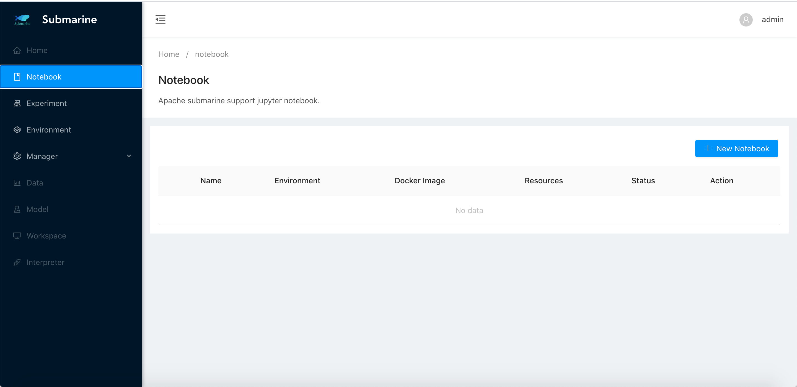
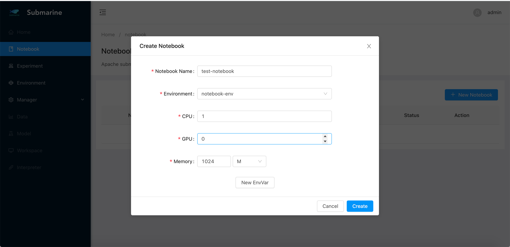
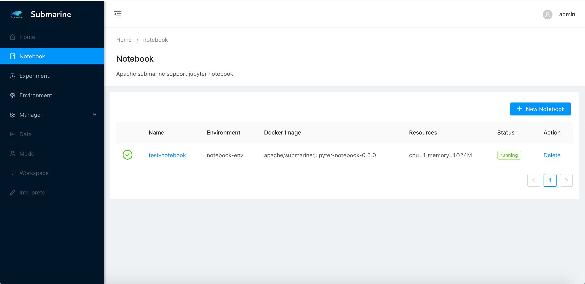

<!--
Licensed to the Apache Software Foundation (ASF) under one
or more contributor license agreements.  See the NOTICE file
distributed with this work for additional information
regarding copyright ownership.  The ASF licenses this file
to you under the Apache License, Version 2.0 (the
"License"); you may not use this file except in compliance
with the License.  You may obtain a copy of the License at

  http://www.apache.org/licenses/LICENSE-2.0

Unless required by applicable law or agreed to in writing,
software distributed under the License is distributed on an
"AS IS" BASIS, WITHOUT WARRANTIES OR CONDITIONS OF ANY
KIND, either express or implied.  See the License for the
specific language governing permissions and limitations
under the License.
-->

# Notebooks Guide

This guide describes how to use Jupyter notebook in Submarine to launch
and manage Jupyter notebooks.

## Working with notebooks

We recommend using Web UI to manage notebooks.

### Notebooks Web UI

Notebooks can be started from the Web UI. You can click the “Notebook” tab in the \
left-hand panel to manage your notebooks.

#### 

To create a new notebook server, click “New Notebook”. You should see a form for entering \
details of your new notebook server.

- Notebook Name : Name of the notebook server. It should be unique and include no spaces.
- Environment : It defines a set of libraries and docker image.
- CPU and Memory
- GPU (optional)
- EnvVar (optional) : Injects environment variables into the notebook.

**If you’re not sure which environment you need, please choose the environment “notebook-env” \
for the new notebook.**

#### 

You should see your new notebook server. Click the name of your notebook server to connect to it.

#### 

## Experiment with your notebook

The environment “notebook-env” includes Submarine Python SDK which can talk to Submarine Server to \
create experiments, as the example below:

```python
from __future__ import print_function
import submarine
from submarine.experiment.models.environment_spec import EnvironmentSpec
from submarine.experiment.models.experiment_spec import ExperimentSpec
from submarine.experiment.models.experiment_task_spec import ExperimentTaskSpec
from submarine.experiment.models.experiment_meta import ExperimentMeta
from submarine.experiment.models.code_spec import CodeSpec

# Create Submarine Client
submarine_client = submarine.ExperimentClient()

# Define TensorFlow experiment spec
environment = EnvironmentSpec(image='apache/submarine:tf-dist-mnist-test-1.0')
experiment_meta = ExperimentMeta(name='mnist-dist',
                                 namespace='default',
                                 framework='Tensorflow',
                                 cmd='python /var/tf_dist_mnist/dist_mnist.py --train_steps=100',
                                 env_vars={'ENV1': 'ENV1'})

worker_spec = ExperimentTaskSpec(resources='cpu=1,memory=1024M',
                                 replicas=1)
ps_spec = ExperimentTaskSpec(resources='cpu=1,memory=1024M',
                                 replicas=1)
code_spec = CodeSpec(sync_mode='git', url='https://github.com/apache/submarine.git')

experiment_spec = ExperimentSpec(meta=experiment_meta,
                                 environment=environment,
                                 code=code_spec,
                                 spec={'Ps' : ps_spec,'Worker': worker_spec})

# Create experiment
experiment = submarine_client.create_experiment(experiment_spec=experiment_spec)

```
