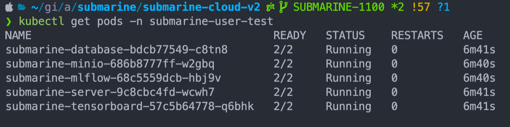
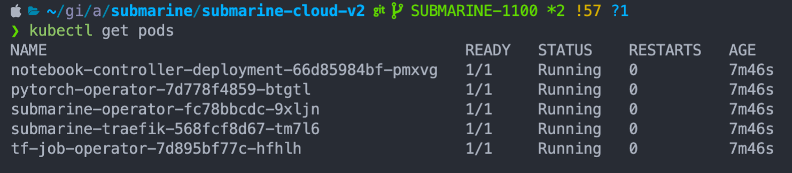

# Submarine Istio

## Traefik-Istio 

Using Traefik as edge router but also leverage istiod as service mesh (exclude gateway).

Note: you have to install [istio](https://istio.io/latest/docs/setup/getting-started/) first.
### Setup

1. Setup Minikube
```bash
minikube start --kubernetes-version=v1.21.6 --cpus=8 --memory=16g
```
2. Setup Istio
```bash
# Only install istiod, no gateway
istioctl install --set profile=minimal -y

# Create separate namespace
kubectl create ns submarine-user-test

# Add istio-injection label to allow istio to inject sidecars
kubectl label namespace submarine-user-test istio-injection=enabled
# You can run `istioctl analyze` to find out the installation problem
```
3. Install application
```bash
# Install dependencies
helm install submarine ../helm-charts/submarine

# Install application
kubectl apply -f submarine-cloud-v2/artifacts/examples/example-submarine.yaml -n submarine-user-test
```

### Result
Default Namespace:

 

Submarine-User-Test Namespace:



### Test
- [Frontend](https://submarine.apache.org/docs/next/devDocs/IntegrationTestE2E/)
```bash
# Forward Port
kubectl port-forward --address 0.0.0.0 service/submarine-traefik 32080:80
```
```bash
# Modify the WORKBENCH_PORT to 4200
# at submarine-test/test_e2e/run_frontend_e2e.sh
...
# ======= Modifiable Variables ======= #
 # Note: URL must start with "http" 
 # (Ref: https://www.selenium.dev/selenium/docs/api/java/org/openqa/selenium/WebDriver.html#get(java.lang.String))
 WORKBENCH_PORT=4200 #<= modify this
 URL="http://127.0.0.1" #<=modify this
 # ==================================== #
```
```bash
# Make sure the Submarine workbench is running on 127.0.0.1:8080
cd submarine/submarine-test/test-e2e
# Method 1: 
mvn verify

# Method 2:
mvn clean install -U
```
- [k8s](https://submarine.apache.org/docs/next/devDocs/IntegrationTestK8s/)
```bash
# Forward Port
kubectl port-forward --address 0.0.0.0 service/submarine-traefik 8080:80

# Install and then Test
mvn install -DskipTests
mvn verify -DskipRat -pl :submarine-test-k8s -Phadoop-2.9 -B
```

## Pure Istio Setup
TODO

