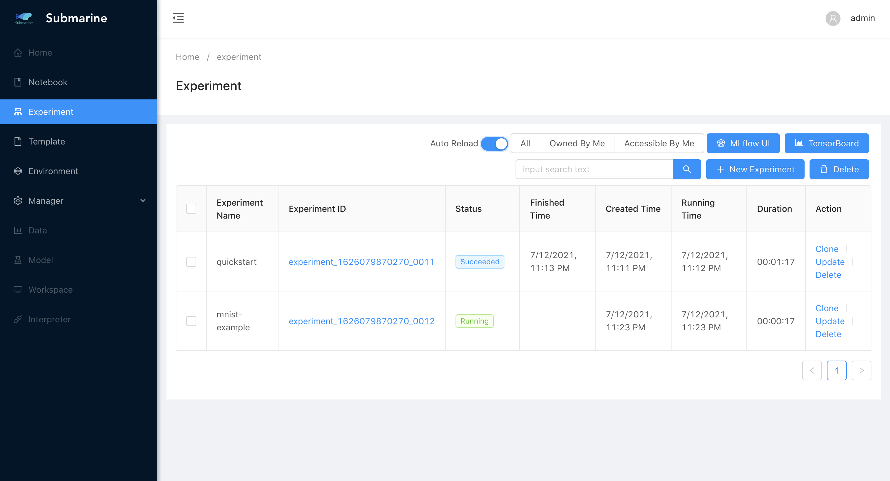
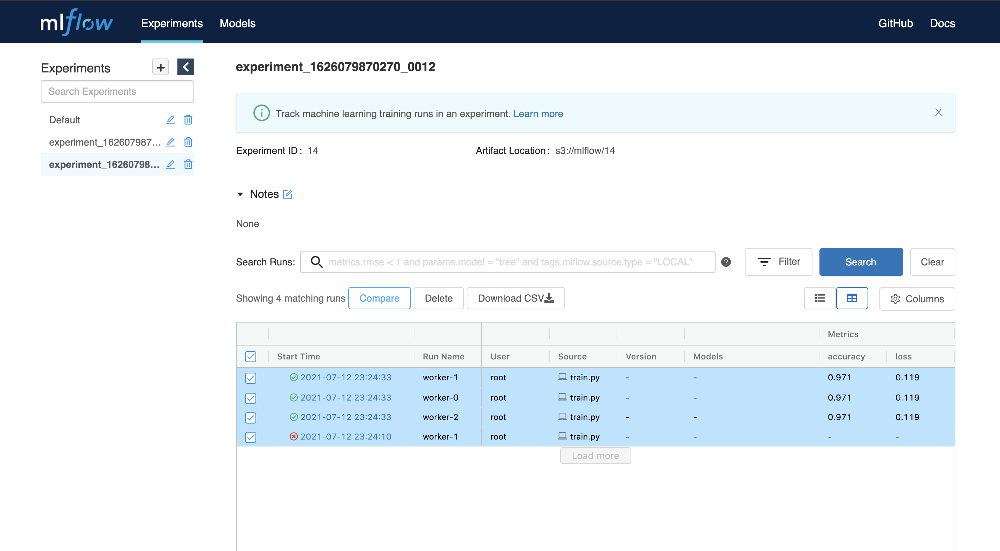

<!--
Licensed to the Apache Software Foundation (ASF) under one
or more contributor license agreements.  See the NOTICE file
distributed with this work for additional information
regarding copyright ownership.  The ASF licenses this file
to you under the Apache License, Version 2.0 (the
"License"); you may not use this file except in compliance
with the License.  You may obtain a copy of the License at

  http://www.apache.org/licenses/LICENSE-2.0

Unless required by applicable law or agreed to in writing,
software distributed under the License is distributed on an
"AS IS" BASIS, WITHOUT WARRANTIES OR CONDITIONS OF ANY
KIND, either express or implied.  See the License for the
specific language governing permissions and limitations
under the License.
-->

This document gives you a quick view on the basic usage of Submarine platform. You can finish each steps of ML model lifecycle on the platform without messing up with the troublesome environment problems.

## Installation

### Prepare a Kubernetes cluster

1. Prerequisite

- Check dependency page for the compatible version
- [kubectl](https://kubernetes.io/docs/tasks/tools/install-kubectl/)
- [helm](https://helm.sh/docs/intro/install/) (Helm v3 is minimum requirement.)
- [minikube](https://minikube.sigs.k8s.io/docs/start/).

2. Start minikube cluster
```
$ minikube start --vm-driver=docker --cpus 8 --memory 4096 --kubernetes-version v1.15.11
```

### Launch submarine in the cluster

1. Clone the project
```
$ git clone https://github.com/apache/submarine.git
```

2. Install the resources by helm chart
```
$ cd submarine
$ helm install submarine ./helm-charts/submarine
```

### Ensure submarine is ready

1. Use kubectl to query the status of pods
```
$ kubectl get pods
```

2. Make sure each pod is `Running`
```
NAME                                              READY   STATUS    RESTARTS   AGE
notebook-controller-deployment-5d4f5f874c-vwds8   1/1     Running   0          3h33m
pytorch-operator-844c866d54-q5ztd                 1/1     Running   0          3h33m
submarine-database-674987ff7d-r8zqs               1/1     Running   0          3h33m
submarine-minio-5fdd957785-xd987                  1/1     Running   0          3h33m
submarine-mlflow-76bbf5c7b-g2ntd                  1/1     Running   0          3h33m
submarine-server-66f7b8658b-sfmv8                 1/1     Running   0          3h33m
submarine-tensorboard-6c44944dfb-tvbr9            1/1     Running   0          3h33m
submarine-traefik-7cbcfd4bd9-4bczn                1/1     Running   0          3h33m
tf-job-operator-6bb69fd44-mc8ww                   1/1     Running   0          3h33m
```

## Example: Submit a mnist distributed example

We put the code of this example [here](google.com). `train.py` is our training script, and `build.sh` is the script to build a docker image.

### 1. Write a python script for distributed training

Take a simple mnist tensorflow script as an example. We choose `MultiWorkerMirroredStrategy` as our distributed strategy.

```python
"""
./dev-support/examples/quickstart/train.py
Reference: https://github.com/kubeflow/tf-operator/blob/master/examples/v1/distribution_strategy/keras-API/multi_worker_strategy-with-keras.py
"""

import tensorflow_datasets as tfds
import tensorflow as tf
from tensorflow.keras import layers, models
from submarine import ModelsClient

def make_datasets_unbatched():
  BUFFER_SIZE = 10000

  # Scaling MNIST data from (0, 255] to (0., 1.]
  def scale(image, label):
    image = tf.cast(image, tf.float32)
    image /= 255
    return image, label

  datasets, _ = tfds.load(name='mnist', with_info=True, as_supervised=True)

  return datasets['train'].map(scale).cache().shuffle(BUFFER_SIZE)


def build_and_compile_cnn_model():
  model = models.Sequential()
  model.add(
      layers.Conv2D(32, (3, 3), activation='relu', input_shape=(28, 28, 1)))
  model.add(layers.MaxPooling2D((2, 2)))
  model.add(layers.Conv2D(64, (3, 3), activation='relu'))
  model.add(layers.MaxPooling2D((2, 2)))
  model.add(layers.Conv2D(64, (3, 3), activation='relu'))
  model.add(layers.Flatten())
  model.add(layers.Dense(64, activation='relu'))
  model.add(layers.Dense(10, activation='softmax'))

  model.summary()

  model.compile(optimizer='adam',
                loss='sparse_categorical_crossentropy',
                metrics=['accuracy'])

  return model

def main():
  strategy = tf.distribute.experimental.MultiWorkerMirroredStrategy(
      communication=tf.distribute.experimental.CollectiveCommunication.AUTO)

  BATCH_SIZE_PER_REPLICA = 4
  BATCH_SIZE = BATCH_SIZE_PER_REPLICA * strategy.num_replicas_in_sync

  with strategy.scope():
    ds_train = make_datasets_unbatched().batch(BATCH_SIZE).repeat()
    options = tf.data.Options()
    options.experimental_distribute.auto_shard_policy = \
        tf.data.experimental.AutoShardPolicy.DATA
    ds_train = ds_train.with_options(options)
    # Model building/compiling need to be within `strategy.scope()`.
    multi_worker_model = build_and_compile_cnn_model()

  class MyCallback(tf.keras.callbacks.Callback):
    def on_epoch_end(self, epoch, logs=None):
      # monitor the loss and accuracy
      print(logs)
      modelClient.log_metrics({"loss": logs["loss"], "accuracy": logs["accuracy"]}, epoch)

  with modelClient.start() as run:
    multi_worker_model.fit(ds_train, epochs=10, steps_per_epoch=70, callbacks=[MyCallback()])


if __name__ == '__main__':
  modelClient = ModelsClient()
  main()
```

### 2. Prepare an environment compatible with the training
Build a docker image equipped with the requirement of the environment.

```bash
$ ./dev-support/examples/quickstart/build.sh 
```

### 3. Submit the experiment

1. Open submarine workbench and click `+ New Experiment`
2. Fill the form accordingly. Here we set 3 workers.

    1. Step 1
    
    2. Step 2
    
    3. Step 3
    
    4. The experiment is successfully submitted
    

### 4. Monitor the process (modelClient)

1. In our code, we use `modelClient` from `submarine-sdk` to record the metrics. To see the result, click `MLflow UI` in the workbench.
2. To compare the metrics of each worker, you can select all workers and then click `compare`

  


### 5. Serve the model (In development)
