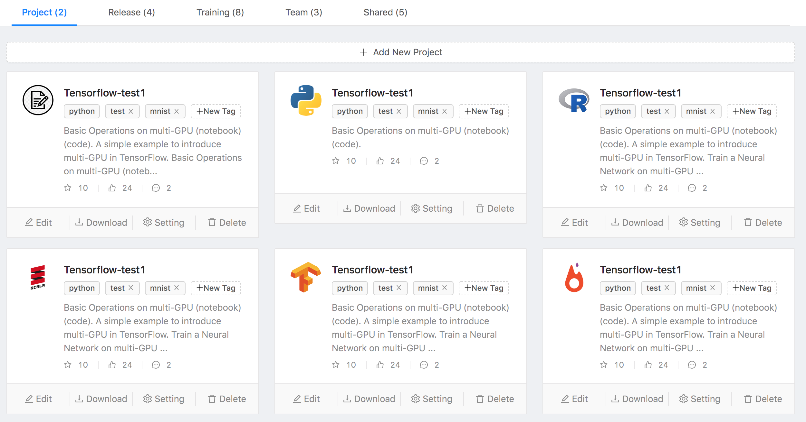
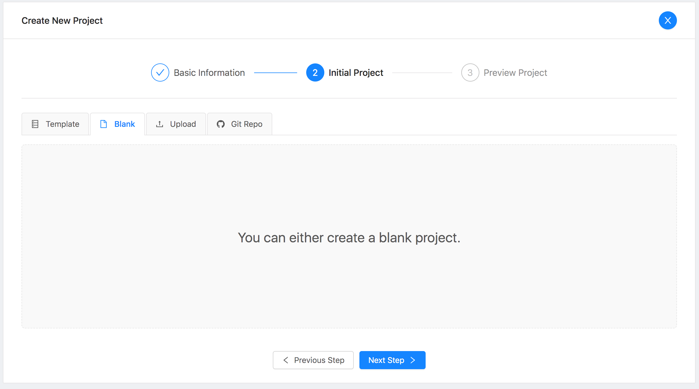

<!--
   Licensed to the Apache Software Foundation (ASF) under one or more
   contributor license agreements.  See the NOTICE file distributed with
   this work for additional information regarding copyright ownership.
   The ASF licenses this file to You under the Apache License, Version 2.0
   (the "License"); you may not use this file except in compliance with
   the License.  You may obtain a copy of the License at
   http://www.apache.org/licenses/LICENSE-2.0
   Unless required by applicable law or agreed to in writing, software
   distributed under the License is distributed on an "AS IS" BASIS,
   WITHOUT WARRANTIES OR CONDITIONS OF ANY KIND, either express or implied.
   See the License for the specific language governing permissions and
   limitations under the License.
-->

English | [简体中文](./README.zh-CN.md)

# Submarine Workbench Introduction

Submarine Workbench is a WEB system for data scientists.
Data scientists can interactively access notebooks, submit/manage jobs, manage models, create model training workflows, access data sets, and more through Submarine Workbench.

## Register

Everyone who needs to use Submarine for machine learning algorithm development can log in to Submarine Workbench's WEB homepage. On the homepage, click the registration link, fill in the user name, email address and password to register the user. At this time, the user status is `waiting for approval` status. 

After receiving the registration request from the user in Submarine Workbench, the administrator sets the operation authority according to the user's needs, sets the user's organization and allocates resources, and sets the user status to `pass the audit`. The user can log in to the Submarine Workbench. Different users have different permission.

## Login

Each Submarine user logs in to the Home page of Submarine Workbench by entering their username and password on the Login page.

## Home

In the Submarine Workbench Home page, the top level shows the user's resource usage and task execution through four charts.

In the `Quick Start` list, the most commonly used feature links in the Workbench are displayed so that users can work quickly.

In the `Open Recent` list, there are nine items that the user has used recently, so you can work quickly.

At `What's New?` In the list, some of the latest features and project information released by Submarine are displayed to help you understand the latest developments in the Submarine project.

## Workspace

Workspace consists primarily of five tab pages, with the total number of items in each tab page's title.

### Project

In the Project page, all the projects created by the user themselves are displayed as cards.

Each Project card consists of the following sections:

1. **Project Type**：Submarine currently supports six types of machine learning algorithm frameworks and development languages: `Notebook`, `Python`, `R`, `Scala`, `Tensorflow`, and `PyTorch`, which are identified by corresponding icons in the project card.
2. **Project Tags**：Users can tag each Project with different tags for easy searching and management.
3. **Github/Gitlab integrated**：Submarine Workbench is system integrated with `Github`/`Gitlab`, and each Project can perform `Watch`, `Star`, `Fork`, and `Comment `operations in Workbench.
   + **Watch**：[TODO]
   + **Star**：[TODO]
   + **Fork**：[TODO]
   + **Comment**：Users can comment on the project.
4. **Edit**：Users can open projects in **Notebook** and perform algorithm development by double-clicking on the project or by clicking the **Edit** button.
5. **Download**：The user downloads the project package locally by clicking the **Download** button.
6. **Setting**：Edit project information such as project name, profile, visibility level and permissions.
7. **Delete**：Delete the project and all included files. 

#### Add New Project

Clicking the **Add New Project** button on the project page will display the guide page for creating the project, and you can create a new project in just three steps.

**Step 1**: Fill in the project name and project description in the **Base Information** step.

+ **Visibility**: Set the visibility level of the item externally
  
  + **Private**: (Default) Set to private project, and all the files included in the project are not publicly displayed. but the execution result of the project can be individually set and exposed in Notebook, so that others can view the visual report of the project.
  + **Team**: Set to team project, select the team name in the team selection box, and other members of the team can access the project according to the set permissions.
  + **Public**: Set to public project, all users in Workbench can view this project through search.
+ **Permission**: Set the external access rights of the project. The permission setting interface will appear only when the **Visibility** of the project is set to **Team** or **Public**.
  
  + **Can View**
  
    When the project's **Visibility** is set to **Team**, other members of the team can **only view** the files for this project.
  
    When the project's **Visibility** is set to **Public**, other members of the Workbench can **only view** the files for this project.
  
  + **Can Edit**
  
    When the project's **Visibility** is set to **Team**, other members of the team can **view** and **edit** the files for this project.
  
    When the project's **Visibility** is set to **Public**, other members of the Workbench can **view** and **edit** the files for this project.
  
  + **Can Execute**
  
    When the project's **Visibility** is set to **Team**, other members of the team can **view**, **edit**, and **execute** the project's files.
  
    When the project's **Visibility** is set to **Public**, other members of the Workbench can **view**, **edit**, and **execute** the project's files.

**Step 2**: In the Initial Project step, Workbench provides four ways to initialize the project.

+ **Template**: Workbench Project templates with several different development languages and algorithm frameworks are built in. You can choose any template to initialize your project and you can execute it directly in Notebook without any modification. It is especially suitable for novices to experience quickly.

  

+ **Blank**：Create a blank project, and later we can manually add the project's file in Notebook

  

+ **Upload**: Initialize your project by uploading a file in notebook format that is compatible with the **Jupyter Notebook** and **Zeppelin Notebook** file formats.

  

+ **Git Repo**: Fork a file in the repository to initialize the project in your **Github**/**Gitlab** account.

  

**Step 3**：Preview the included files in the project

+ **Save**: Save the project to Workspace.
+ **Open In Notebook**: Save the project to Workspace and open the project with Notebook.

### Release

[TODO]

### Training

[TODO]

### Team

[TODO]

### Shared

[TODO]

## Interpreters

[TODO]

## Job

[TODO]

## Data

[TODO]

## Model

[TODO]

## Manager

### User

[TODO]

### Team

[TODO]

### Data Dict

[TODO]

### Department

[TODO]

## How to run workbench

[How To Run Submarine Workbench Guide](./HowToRun.md)